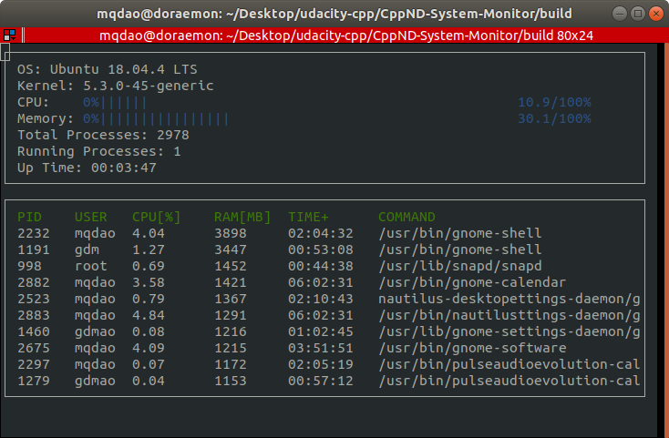

# CppND-System-Monitor

My submission for System Monitor Project in the Object Oriented Programming Course of the [Udacity C++ Nanodegree Program](https://www.udacity.com/course/c-plus-plus-nanodegree--nd213). 



## Instalation

The monitor is rendered using [ncurses](https://www.gnu.org/software/ncurses/). Install `ncurses` with

```
sudo apt install libncurses5-dev libncursesw5-dev
```

To make the project, execute the following command in the project's top directory

```
make build
```

This command creates a new directory name `build` where the resulted executable `monitor` is resigned.

## Getting Started

This project is made of 3 classes defined in `system.h`, `process.h`, and `processor.h` together with 1 namespace defined in `linux_parser.h`.

* Linux Parser namespace
  - This namespace is a collection of functions, each of which parses a specific system file to retrieve information for the monitor.

* System class
  - This class computes system related statistics (e.g. OS name, memory usage, cpu usage)
  - It's also a compound of two other class Processor and Process to aggregate information relates to cpu (processor) and processes and distribute them to the monitor 

* Process class
  - Collects process information such as pid, memory usage, user

* Processor class
  - Computes system's CPU usage
